# OnlyWorkshop — Platform Architecture & Business Overview

> **Prepared for**: Clients, Investors & Stakeholders  
> **Date**: March 2026  
> **Version**: 1.0

---

## 1. Executive Summary

**OnlyWorkshop** is a modern marketplace SaaS platform connecting creative workshop hosts (potters, painters, bakers, woodworkers) with learners looking for hands-on experiences across Indian cities. Think **"BookMyShow for Creative Workshops"**.

The platform handles discovery, booking, payments, host management, and post-experience feedback — creating a **full-lifecycle ecosystem** for the experience economy.

---

## 2. Platform Vision

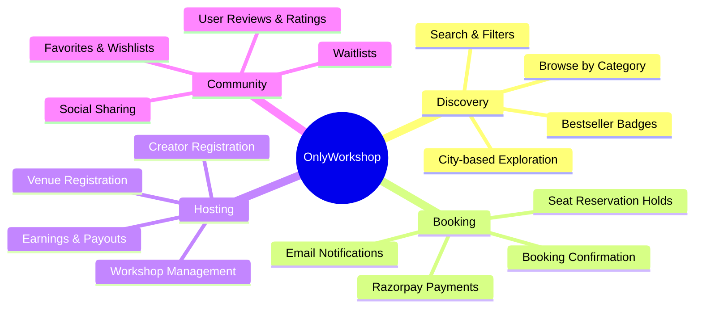

---

## 3. How It Works — User Journey

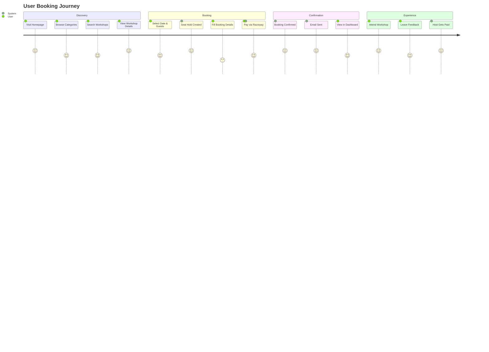

---

## 4. System Architecture

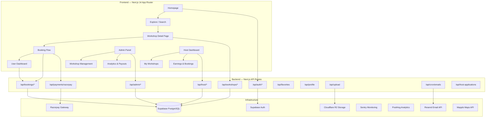

---

## 5. Database Schema — Entity Relationship Diagram

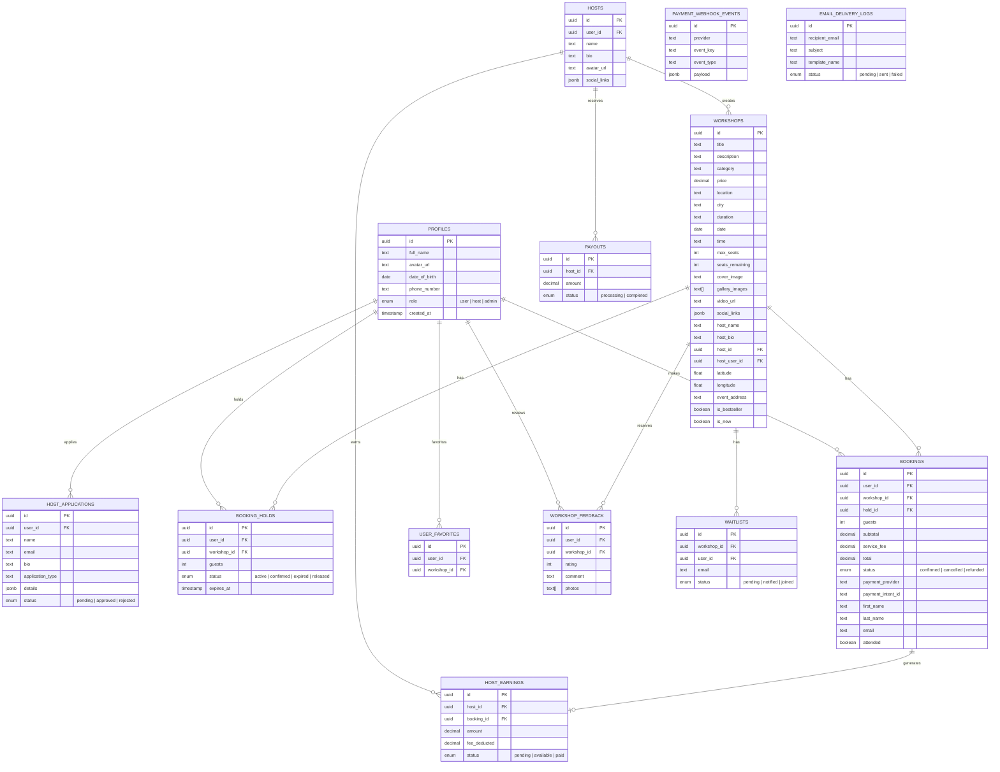

---

## 6. Booking & Payment Flow

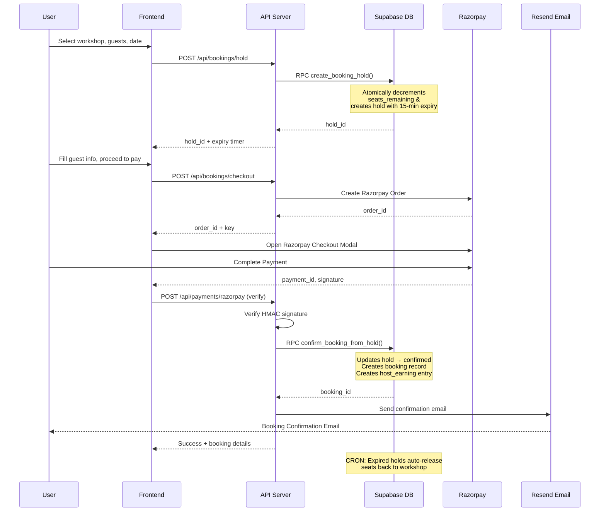

---

## 7. Host Onboarding & Earnings Flow

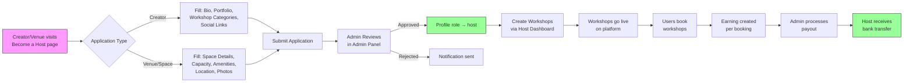

---

## 8. Tech Stack Architecture

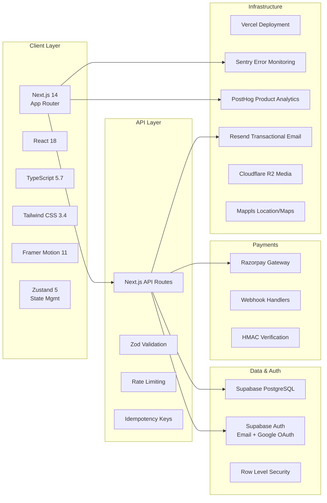

---

## 9. Key Platform Features

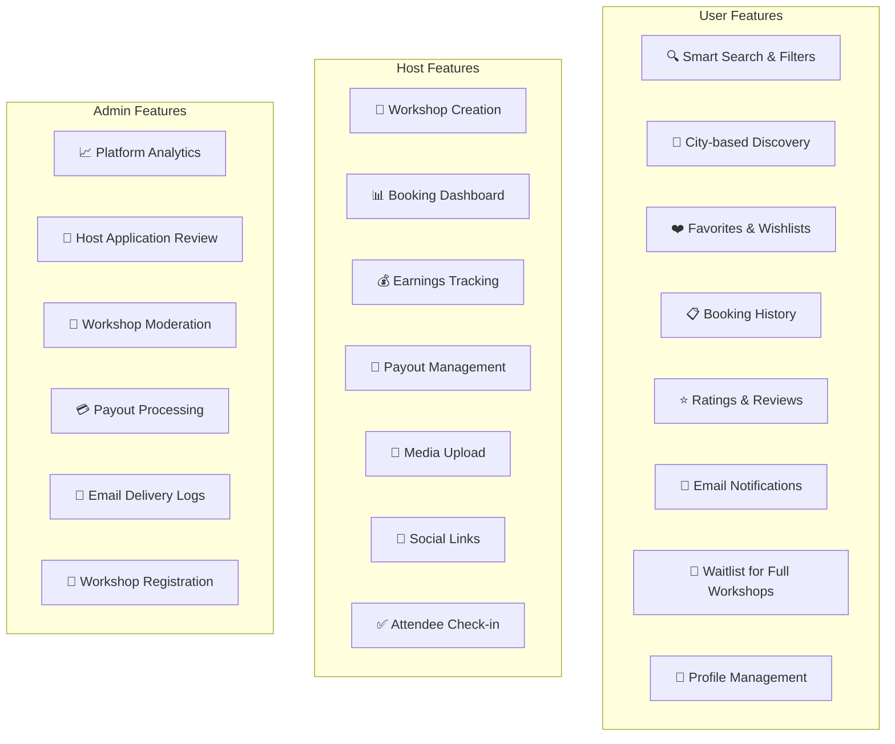

---

## 10. Revenue Model

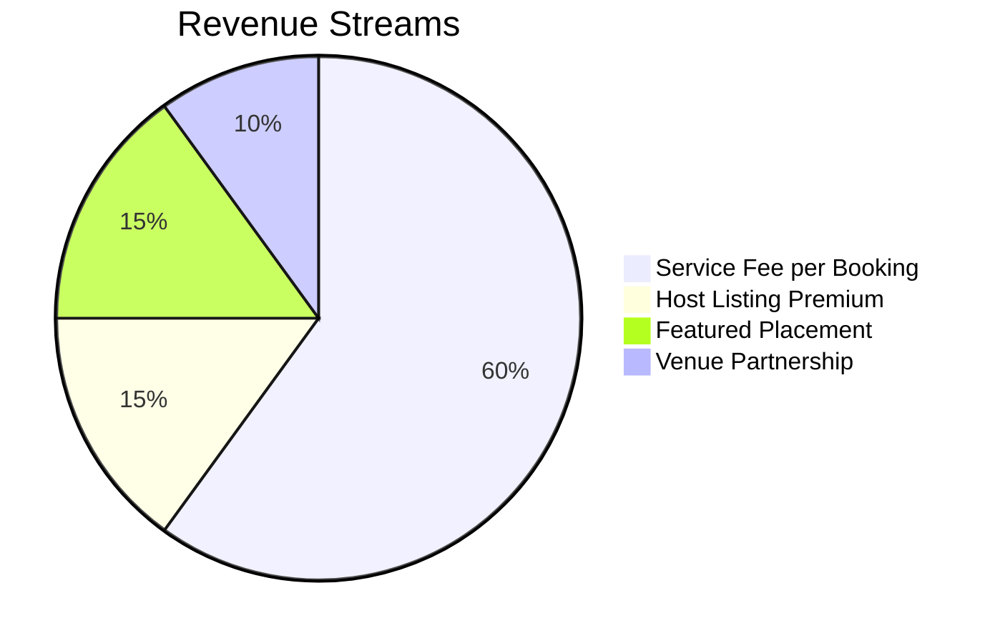

| Revenue Stream | Description | Model |
|---|---|---|
| **Service Fee** | Platform fee on each booking transaction | % of booking value |
| **Host Premium** | Premium listing features for hosts | Monthly subscription |
| **Featured Placement** | Promoted workshop slots on homepage | Pay-per-placement |
| **Venue Partnerships** | Commission on venue-hosted workshops | Revenue share |

---

## 11. Growth & Scalability Roadmap

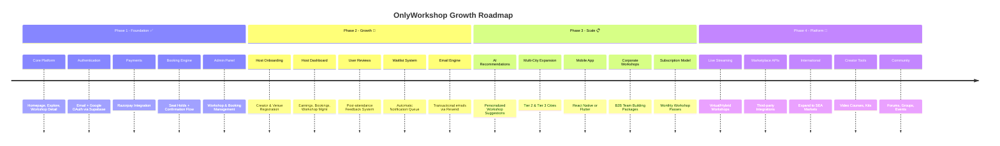

---

## 12. Future Technology Roadmap

### For Users

| Technology | Benefit | Impact |
|---|---|---|
| **AI-Powered Recommendations** | Personalized workshop suggestions based on interests & history | Higher engagement, repeat bookings |
| **Smart Search with NLP** | Natural language queries like "pottery classes this weekend near me" | Faster discovery, better UX |
| **AR/VR Previews** | Virtual tour of workshop spaces before booking | Increased confidence & conversions |
| **Push Notifications** | Real-time booking updates, new workshop alerts, waitlist notifications | Better retention |
| **Social Features** | Follow creators, share experiences, group bookings | Viral growth, community building |
| **Workshop Passes** | Monthly subscription for unlimited/discounted workshops | Revenue predictability, user loyalty |
| **In-App Messaging** | Direct chat between users and hosts | Better pre-booking experience |

### For Business Growth

| Technology | Benefit | Impact |
|---|---|---|
| **PostHog Analytics** | Product usage insights, conversion funnel tracking | Data-driven decisions |
| **Sentry Monitoring** | Real-time error tracking, performance monitoring | 99.9% uptime reliability |
| **Automated Payouts** | Scheduled host payouts with ledger tracking | Scalable host operations |
| **CRON Email Engine** | Automated reminders, follow-ups, re-engagement | Reduced no-shows, better retention |
| **Rate Limiting & Security** | Protection against abuse, DDoS, fraudulent bookings | Platform integrity |
| **CDN (Cloudflare R2)** | Fast global media delivery for workshop images & videos | Better performance worldwide |
| **Vercel Edge Network** | Global CDN + serverless deployment | Sub-second page loads globally |
| **CI/CD Pipeline** | Automated testing (Vitest + Playwright) and deployment | Rapid feature delivery |

---

## 13. Business Metrics Dashboard (Current Capabilities)

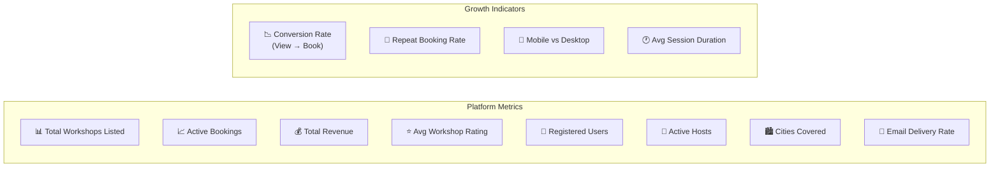

---

## 14. Security & Compliance

| Layer | Implementation |
|---|---|
| **Authentication** | Supabase Auth (JWT tokens, email + OAuth) |
| **Authorization** | Row Level Security (RLS) policies in PostgreSQL |
| **API Security** | Rate limiting, idempotency keys, HMAC signature verification |
| **Payment Security** | PCI DSS compliant via Razorpay (no card data touches our servers) |
| **Data Validation** | Zod schema validation on all API inputs |
| **Error Monitoring** | Sentry for real-time error tracking |
| **HTTPS** | Enforced across all endpoints via Vercel |

---

## 15. Competitive Advantage

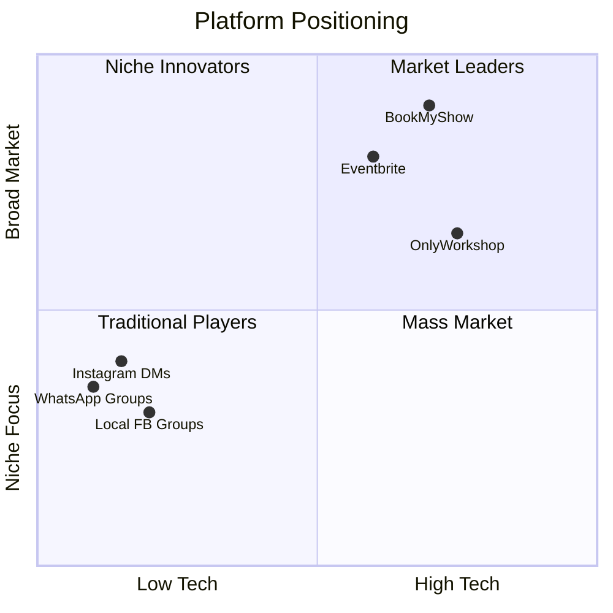

**OnlyWorkshop's Edge:**
- **Vertical focus** on creative/hands-on workshops (not general events)
- **Purpose-built** booking flow with seat holds & real-time availability
- **Two-sided marketplace** with host earnings, payouts & analytics
- **India-first** with Razorpay, Mappls Maps, INR pricing
- **Modern tech stack** enabling rapid iteration and premium UX

---

> **Contact**: hello@onlyworkshop.com  
> **Website**: onlyworkshop.com
