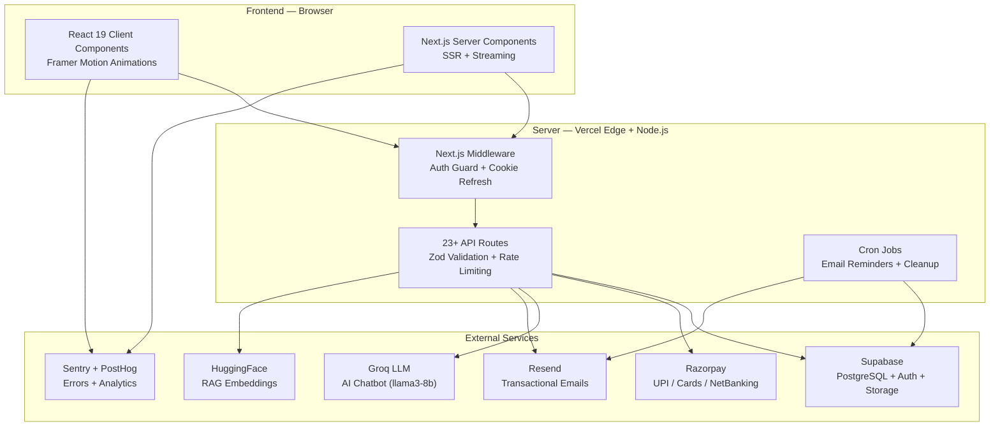
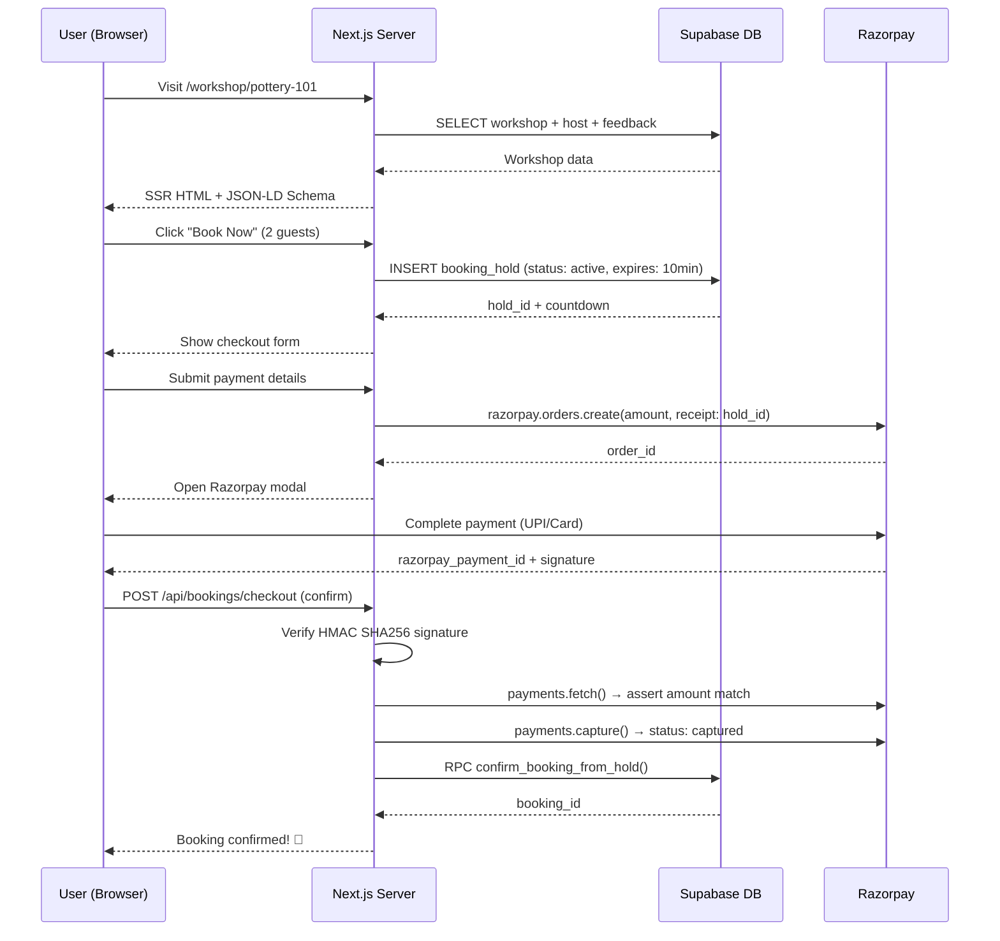
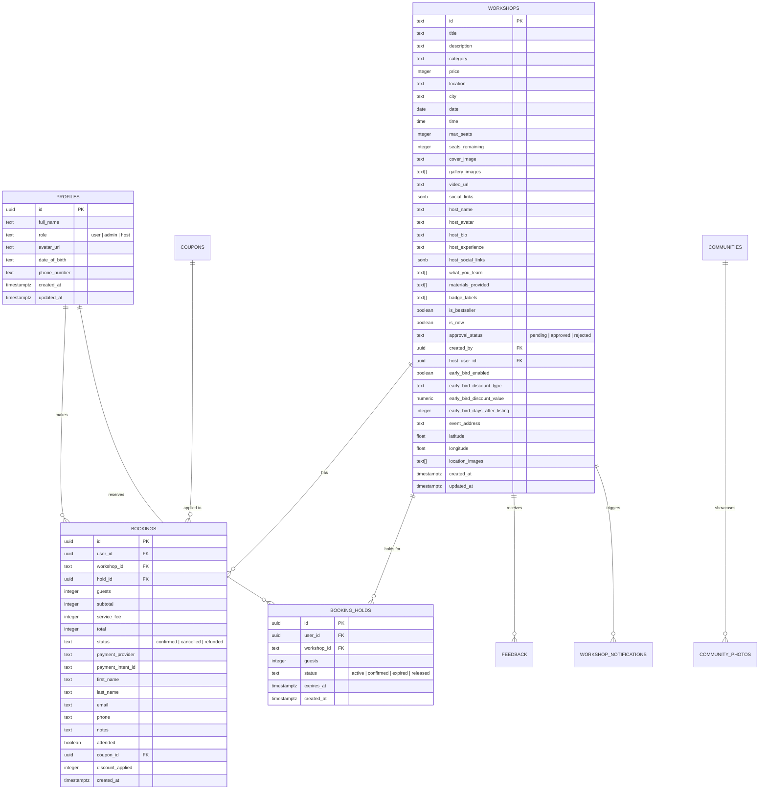
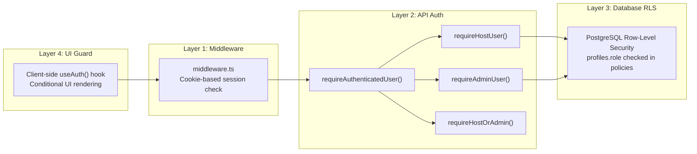

# OnlyWorkshop — Complete Platform Analysis

> **Repository**: [morechaitanya606/workshop](https://github.com/morechaitanya606/workshop)
> **Branch analysed**: `main`
> **Analysis date**: 10 August 2026

---

## Table of Contents

1. [Executive Summary](#1-executive-summary)
2. [How the Website Is Created — Architecture Deep-Dive](#2-how-the-website-is-created)
3. [Technology Stack & Why Each Tool Was Chosen](#3-technology-stack)
4. [Complete Feature Inventory](#4-complete-feature-inventory)
5. [Why This Platform Will Help the Business Long-Term](#5-long-term-business-value)
6. [Strategic Recommendations — Why the Client Should Double Down](#6-strategic-recommendations)
7. [Why You Should NOT Deploy As-Is (Pre-Flight Blockers)](#7-do-not-deploy-as-is)
8. [Good Features — What Makes This Platform Stand Out](#8-standout-features)

---

## 1. Executive Summary

**OnlyWorkshop** is a production-grade, two-sided marketplace for discovering and booking creative, hands-on workshops across Indian cities — pottery, painting, baking, woodworking, candle-making, and DIY crafts.

It is **not** a simple static website. It is a full-stack SaaS application with:

- Server-side rendering & API endpoints (Next.js 15 App Router)
- Real-time seat reservation with atomic database transactions
- Razorpay payment gateway with server-side signature verification
- AI-powered multi-lingual chatbot (English, Hindi, Hinglish, Marathi)
- Automated email lifecycle (confirmations, reminders, feedback requests)
- Separate portals for consumers, workshop hosts, and platform admins
- Enterprise security: Row-Level Security (RLS), rate limiting, Sentry error tracking

> [!IMPORTANT]
> This platform **cannot run on GitHub Pages**. GitHub Pages only serves static files. OnlyWorkshop requires a Node.js server runtime for its 23+ API routes, middleware authentication, payment processing, and database operations. It is designed and pre-configured for **Vercel** deployment with **Supabase** as the managed backend.

---

## 2. How the Website Is Created

### 2.1 High-Level Architecture



### 2.2 Route Structure

The application uses **Next.js App Router route groups** to cleanly separate public and authenticated sections:

| Route Group | Purpose | Auth Required |
|---|---|---|
| `(public)/` | Homepage, Explore, Workshop Details, Communities, Legal pages | ❌ No |
| `(public)/workshop/[id]` | Individual workshop with gallery, video, host profile, booking sidebar | ❌ No |
| `(public)/explore` | Browse all workshops with city, category, price, and date filters | ❌ No |
| `(public)/communities/[slug]` | Community hub pages with host profiles and social links | ❌ No |
| `(private)/booking` | 2-step checkout flow with guest info + payment | ✅ Yes |
| `(private)/dashboard` | Customer booking history and profile | ✅ Yes |
| `(private)/host/` | Workshop creator studio — create, edit, earnings, check-in, chatbot | ✅ Yes (Host role) |
| `(private)/admin/` | Platform management — approvals, analytics, payouts, FAQs, settings | ✅ Yes (Admin role) |
| `api/` | 23+ REST endpoints for bookings, payments, uploads, chat, cron, etc. | Mixed |

### 2.3 Data Flow: From Discovery to Booking



### 2.4 File Structure Overview

```
workshop/
├── .github/workflows/ci.yml          # CI: typecheck → lint → test → build
├── .husky/                            # Git hooks: lint-staged on commit
├── DEPLOYMENT.md                      # Production checklist
├── README.md                          # Full documentation
│
└── app/                               # ← Vercel root directory
    ├── public/images/                 # Static assets (logo, OG images)
    ├── supabase/migrations/           # 26 SQL migrations (RLS, RPCs, tables)
    ├── vercel.json                     # Cron schedule config
    │
    └── src/
        ├── app/
        │   ├── (public)/              # SEO pages (Home, Explore, Workshop, etc.)
        │   ├── (private)/             # Auth-guarded (Booking, Host, Admin)
        │   ├── api/                   # 23+ REST endpoints
        │   ├── auth/                  # Login, Signup, Callback
        │   ├── globals.css            # Design tokens + utility classes
        │   ├── layout.tsx             # Root layout (fonts, providers, metadata)
        │   ├── sitemap.ts             # Dynamic XML sitemap
        │   └── robots.ts             # robots.txt generation
        │
        ├── components/
        │   ├── home/                  # 11 homepage section components
        │   ├── ui/                    # 17 reusable UI primitives
        │   ├── admin/                 # Admin dashboard components
        │   ├── host/                  # Host studio shell
        │   ├── workshops/             # Attendee panel, FAQ panel
        │   ├── communities/           # Community cards
        │   ├── Navbar.tsx             # Auth-aware navigation (22KB)
        │   ├── Footer.tsx             # Site-wide footer (10KB)
        │   ├── SupportChatbot.tsx     # AI chatbot widget (21KB)
        │   ├── WorkshopCard.tsx       # Workshop preview card (22KB)
        │   └── SurpriseBox.tsx        # Floating promotional widget
        │
        ├── emails/                    # React Email templates
        │   ├── BookingConfirmation.tsx
        │   ├── WorkshopReminder.tsx
        │   └── FeedbackRequest.tsx
        │
        ├── lib/
        │   ├── env.ts                 # Zod-validated environment config
        │   ├── auth-context.tsx       # Supabase auth provider + useAuth hook
        │   ├── api-client.ts          # 38KB typed API client
        │   ├── chatbot.ts             # 736-line AI chatbot engine
        │   ├── support-chat.ts        # 34KB intent resolution engine
        │   ├── database.types.ts      # Auto-generated Supabase types (40KB)
        │   ├── validators.ts          # Zod schemas for all API inputs (17KB)
        │   ├── rate-limit.ts          # In-memory + Upstash Redis limiter
        │   ├── email.ts               # Resend email pipeline with delivery logs
        │   ├── razorpay-server.ts     # Server-side Razorpay helpers
        │   └── ... (50+ library files)
        │
        └── middleware.ts              # Auth cookie refresh + admin route guard
```

---

## 3. Technology Stack

### 3.1 Full Technology Matrix

| Layer | Technology | Version | Why This Was Chosen |
|---|---|---|---|
| **Framework** | Next.js (App Router) | 15.5 | Server Components for zero-JS SEO pages; API routes eliminate need for separate backend; streaming SSR for fast TTFB |
| **UI Library** | React | 19.2 | Latest concurrent features, server/client component boundary, automatic batching |
| **Language** | TypeScript | 5.8 | End-to-end type safety from database schema to API response to UI component props |
| **Styling** | Tailwind CSS | 3.4 | Utility-first CSS with custom design tokens (cream, terracotta, clay palette); rapid iteration without CSS file bloat |
| **Animations** | Framer Motion | 12 | Declarative animation library; scroll reveals, page transitions, reduced-motion accessibility built-in |
| **Icons** | Lucide React | 1.17 | Tree-shakeable icon library; consistent stroke-width aesthetic |
| **Database** | Supabase (PostgreSQL) | — | Managed Postgres with Row-Level Security, real-time subscriptions, auto-generated REST API, and built-in Auth |
| **Authentication** | Supabase Auth (SSR) | 0.10 | Email/password + Google OAuth; cookie-based SSR sessions; automatic token refresh via middleware |
| **Payments** | Razorpay | 2.9 | India's leading payment gateway; UPI, cards, netbanking, wallets; server-side HMAC signature verification |
| **AI Chatbot** | Groq (llama3-8b-8192) | — | Ultra-fast LLM inference (~200ms); handles workshop FAQs in 4 languages with context-aware responses |
| **RAG Embeddings** | HuggingFace (multilingual-e5-base) | — | Multi-lingual vector embeddings for semantic FAQ matching; supports Hindi/Marathi queries |
| **Email** | Resend + React Email | 6.12 | Transactional email with React component templates; delivery logging to database |
| **Media Processing** | Sharp + heic-convert | 0.34 | Server-side image optimization; auto-converts iPhone HEIC photos to WebP |
| **Image Cropping** | React Easy Crop | 6.0 | Client-side photo cropping for host profile pictures and gallery uploads |
| **Schema Validation** | Zod | 4.4 | Runtime type validation for all API inputs, environment variables, and form data |
| **Error Tracking** | Sentry | 10.56 | Full-stack error capture (client + server + edge); payment flow instrumentation |
| **Product Analytics** | PostHog | 1.285 | Privacy-friendly analytics; funnel tracking, feature flags, session replay |
| **Rate Limiting** | Custom + Upstash Redis | — | In-memory rate limiter for dev; Upstash Redis for distributed serverless rate limiting in production |
| **CI/CD** | GitHub Actions | — | Automated pipeline: typecheck → lint → test → build on every push/PR |
| **Code Quality** | ESLint 9 + Prettier + Husky + lint-staged | — | Pre-commit hooks enforce formatting; zero-warning lint policy |
| **Testing** | Vitest + Testing Library | 4.0 | Fast unit/integration tests; JSDOM environment for component testing |
| **Deployment** | Vercel | — | Zero-config Next.js hosting; edge functions, cron jobs, preview deployments per PR |
| **Maps** | Mappls (MapMyIndia) | — | India-specific mapping service for workshop venue locations |

### 3.2 Design System

| Token | Hex | CSS Variable | Usage |
|---|---|---|---|
| **Cream** | `#F5EFE6` | `--cream` | Primary background |
| **Black** | `#1A1A1A` | `--dark` | Primary text |
| **Terracotta** | `#C76B4A` | `--terracotta` | Primary buttons, CTAs, accents |
| **Clay** | `#D4A574` | `--clay` | Secondary elements, borders |
| **Warm Gray** | `#8B8175` | `--warm-gray` | Muted/secondary text |

| Typography Role | Font Family | Weight |
|---|---|---|
| Headings | Playfair Display | 600 / 700 |
| Body | Inter | 400 / 500 |

---

## 4. Complete Feature Inventory

### 4.1 Consumer-Facing Features

| # | Feature | Description | Key Files |
|---|---|---|---|
| 1 | **Animated Hero Section** | Full-width hero with parallax background, animated headline, and search CTA | [HeroSection.tsx](file:///d:/Users/Chait/Pratice/tts/workshop/app/src/components/home/HeroSection.tsx) |
| 2 | **Category Filter Pills** | Horizontal scrollable category chips (Pottery, Painting, Baking, etc.) | [CategoryFilter.tsx](file:///d:/Users/Chait/Pratice/tts/workshop/app/src/components/CategoryFilter.tsx) |
| 3 | **Workshop Grid + Horizontal Scroll** | Responsive card grid with snap scrolling, hover scale animations | [WorkshopGridSection.tsx](file:///d:/Users/Chait/Pratice/tts/workshop/app/src/components/home/WorkshopGridSection.tsx) |
| 4 | **Recently Viewed Workshops** | Client-side localStorage tracking of visited workshops | [recently-viewed.ts](file:///d:/Users/Chait/Pratice/tts/workshop/app/src/lib/recently-viewed.ts) |
| 5 | **Workshop Detail Page** | Multi-image gallery, video player modal, host profile, sticky booking sidebar | [WorkshopClient.tsx](file:///d:/Users/Chait/Pratice/tts/workshop/app/src/app/(public)/workshop/[id]/WorkshopClient.tsx) |
| 6 | **Explore Page with Filters** | Browse all workshops with city, category, date, price range, and sort | [ExploreClient.tsx](file:///d:/Users/Chait/Pratice/tts/workshop/app/src/app/(public)/explore/ExploreClient.tsx) |
| 7 | **Community Hub Pages** | Dedicated pages per creative community with host info, social links, and similar communities | [communities/[slug]/page.tsx](file:///d:/Users/Chait/Pratice/tts/workshop/app/src/app/(public)/communities/[slug]/page.tsx) |
| 8 | **Social Proof Section** | Testimonials, stats counters, and trust badges | [SocialProofSection.tsx](file:///d:/Users/Chait/Pratice/tts/workshop/app/src/components/home/SocialProofSection.tsx) |
| 9 | **Partners Marquee** | Auto-scrolling logo carousel of venue/brand partners | [PartnersMarquee.tsx](file:///d:/Users/Chait/Pratice/tts/workshop/app/src/components/home/PartnersMarquee.tsx) |
| 10 | **Community Photo Gallery** | Masonry grid of user-submitted event photos | [CommunityGallerySection.tsx](file:///d:/Users/Chait/Pratice/tts/workshop/app/src/components/home/CommunityGallerySection.tsx) |
| 11 | **"How It Works" Section** | Step-by-step visual guide (Discover → Book → Create) | [HowItWorksSection.tsx](file:///d:/Users/Chait/Pratice/tts/workshop/app/src/components/home/HowItWorksSection.tsx) |
| 12 | **Special Event / Promotional Banner** | Dynamic floating gift box + banner for time-limited promotions | [SurpriseBox.tsx](file:///d:/Users/Chait/Pratice/tts/workshop/app/src/components/SurpriseBox.tsx), [SpecialEventBanner.tsx](file:///d:/Users/Chait/Pratice/tts/workshop/app/src/components/home/SpecialEventBanner.tsx) |
| 13 | **Past Event Notifications** | "Notify me when similar workshops launch" + "Notify me about this creator" | [PastEventHighlight.tsx](file:///d:/Users/Chait/Pratice/tts/workshop/app/src/components/home/PastEventHighlight.tsx) |
| 14 | **AI Support Chatbot** | Multi-lingual chatbot (EN/HI/Hinglish/Marathi) with lead capture and FAQ matching | [SupportChatbot.tsx](file:///d:/Users/Chait/Pratice/tts/workshop/app/src/components/SupportChatbot.tsx), [chatbot.ts](file:///d:/Users/Chait/Pratice/tts/workshop/app/src/lib/chatbot.ts) |
| 15 | **Command Palette (Cmd+K)** | Keyboard-accessible quick search and navigation | [CommandPalette.tsx](file:///d:/Users/Chait/Pratice/tts/workshop/app/src/components/ui/CommandPalette.tsx) |
| 16 | **Social Share Buttons** | Share workshops via WhatsApp, Twitter, Facebook, and copy-link | [SocialShareButtons.tsx](file:///d:/Users/Chait/Pratice/tts/workshop/app/src/components/SocialShareButtons.tsx) |
| 17 | **Cookie Consent Banner** | GDPR-style consent banner for analytics cookies | [CookieConsentBanner.tsx](file:///d:/Users/Chait/Pratice/tts/workshop/app/src/components/CookieConsentBanner.tsx) |
| 18 | **Back-to-Top Button** | Smooth scroll-to-top with scroll progress indicator | [BackToTop.tsx](file:///d:/Users/Chait/Pratice/tts/workshop/app/src/components/ui/BackToTop.tsx), [ScrollProgress.tsx](file:///d:/Users/Chait/Pratice/tts/workshop/app/src/components/ui/ScrollProgress.tsx) |
| 19 | **Workshop FAQ Accordion** | Expandable FAQ section on workshop detail pages | [WorkshopFAQ.tsx](file:///d:/Users/Chait/Pratice/tts/workshop/app/src/components/WorkshopFAQ.tsx) |

### 4.2 Booking & Payment Features

| # | Feature | Description |
|---|---|---|
| 20 | **Atomic Seat Hold System** | Time-limited seat reservation with countdown timer; prevents double-booking under concurrent load |
| 21 | **Razorpay Integration** | Full payment flow: order creation → modal → HMAC signature verification → capture → booking confirmation |
| 22 | **Dynamic Service Fee** | Platform fee configurable live from admin settings (stored in `platform_settings` table) |
| 23 | **Multi-Condition Coupon Engine** | Supports flat/percentage discounts, min order value, workshop-specific, category-specific, usage limits, and date windows |
| 24 | **Waitlist System** | When workshops are sold out, users can join a waitlist and get notified on cancellations |
| 25 | **Booking Cutoff** | Bookings automatically close 3 hours before workshop start time |
| 26 | **Idempotent Payment Confirmation** | Duplicate payment confirmations safely return the existing booking instead of creating duplicates |

### 4.3 Host Portal Features

| # | Feature | Description |
|---|---|---|
| 27 | **Workshop Creation & Editing** | Full form: title, description, category, price, date/time, location, seats, gallery, video, social links, host bio |
| 28 | **Live Attendee Check-in** | Table view of all booked guests with one-click check-in/check-out toggle |
| 29 | **Earnings Dashboard** | Revenue tracking and payout history for workshop hosts |
| 30 | **Host AI Chatbot (RAG)** | Per-host chatbot trained on their specific FAQ knowledge base using vector embeddings |
| 31 | **Host Settings** | Profile management, social links, and notification preferences |
| 32 | **Workshop Approval Flow** | New workshops require admin approval before becoming bookable |

### 4.4 Admin Portal Features

| # | Feature | Description |
|---|---|---|
| 33 | **Admin Dashboard** | Stats overview: active workshops, total bookings, revenue, average ratings |
| 34 | **Workshop Approvals** | Review and approve/reject host-submitted workshops |
| 35 | **Host Application Management** | Review and onboard new workshop host applications |
| 36 | **Payout Management** | Track and process creator payouts |
| 37 | **FAQ Management** | CRUD interface for chatbot FAQ knowledge base |
| 38 | **Community Photo Moderation** | Review and approve user-submitted community photos |
| 39 | **Platform Settings** | Configure service fees, hero images, cafe partners, special events |
| 40 | **Support Ticket Dashboard** | View and respond to customer support tickets |
| 41 | **Analytics Dashboard** | Platform-level analytics and insights |
| 42 | **Feedback Review** | Review and manage workshop feedback/ratings |

### 4.5 SEO & Technical Features

| # | Feature | Description |
|---|---|---|
| 43 | **Dynamic Sitemap** | Auto-generated XML sitemap including all workshops and community pages |
| 44 | **robots.txt** | Programmatic robots.txt generation |
| 45 | **OpenGraph + Twitter Cards** | Per-page OG images, titles, and descriptions for social sharing |
| 46 | **JSON-LD Structured Data** | Schema.org Organization markup on homepage |
| 47 | **Canonical URLs** | Proper canonical URL tags on all pages |
| 48 | **ISR (Incremental Static Regeneration)** | `revalidate = 60` on public pages for CDN caching with 60-second freshness |
| 49 | **Error Boundaries** | Custom error pages (`error.tsx`, `global-error.tsx`, `not-found.tsx`) |
| 50 | **Loading Skeletons** | Shimmer loading states for async page transitions |
| 51 | **Health Check Endpoint** | `/healthcheck` for uptime monitoring |

### 4.6 Email Automation

| # | Feature | Description |
|---|---|---|
| 52 | **Booking Confirmation Email** | Sent immediately after successful payment with workshop details |
| 53 | **Workshop Reminder Email** | Sent 24 hours before workshop start via Vercel Cron |
| 54 | **Feedback Request Email** | Sent after workshop completion requesting reviews |
| 55 | **Email Delivery Logging** | All emails logged to `email_delivery_logs` table with status tracking (pending → sent / failed) |
| 56 | **Career Application Email** | Contact form submissions forwarded to team inbox |

### 4.7 Security & Infrastructure

| # | Feature | Description |
|---|---|---|
| 57 | **Row-Level Security (RLS)** | PostgreSQL RLS on all tables; users can only access their own data |
| 58 | **Middleware Auth Guard** | Server-side session validation on every request to private routes |
| 59 | **Role-Based Access Control** | Admin, Host, and User roles enforced at middleware and API level |
| 60 | **Zod Schema Validation** | All API inputs validated with strict Zod schemas before processing |
| 61 | **Rate Limiting** | Per-endpoint rate limiting (in-memory for dev, Upstash Redis for prod) |
| 62 | **HMAC Payment Verification** | Server-side Razorpay signature verification prevents forged payment confirmations |
| 63 | **Environment Variable Validation** | `assertProductionEnv()` blocks deployment if critical env vars are missing |
| 64 | **Sentry Error Tracking** | Full-stack error capture with payment flow context tags |
| 65 | **HEIC Image Conversion** | Auto-converts iPhone HEIC uploads to standard formats |
| 66 | **Payment Notification Webhook** | Internal webhook receiver for post-payment event processing with HMAC validation |

---

## 5. Long-Term Business Value

### 5.1 Why This Platform Is a Strong Foundation

| Advantage | Explanation |
|---|---|
| **Solves a Real Fragmented Market** | Creative workshops today are booked via Instagram DMs, WhatsApp groups, and Google Forms. OnlyWorkshop provides a single trusted destination with verified hosts, instant payments, and professional presentation. |
| **Two-Sided Network Effects** | More hosts attract more customers; more customers attract more hosts. Once critical mass is reached in a city, the platform becomes the default. |
| **SEO-Driven Organic Growth** | Every workshop page generates unique SEO content with structured data, OpenGraph cards, and city-specific URLs. Over time, Google will index hundreds of workshop pages, driving free organic traffic. |
| **Multi-Revenue Model** | Platform service fee per ticket (configurable), host commission splits, featured placement fees, and B2B partnership revenue from venue cafes and supply brands. |
| **Low Marginal Cost at Scale** | Serverless architecture (Vercel + Supabase) means infrastructure costs scale linearly with usage — no expensive always-on servers. |
| **Creator Lock-in Through Tools** | Hosts who use the earnings dashboard, attendee check-in, automated emails, and AI chatbot become dependent on the platform's operational tools, reducing churn. |
| **Data Moat** | Every booking, review, and interaction builds a rich dataset for recommendations, pricing insights, and trend prediction that competitors cannot replicate. |

### 5.2 Market Opportunity

> India's experience economy is projected to grow at 15-20% CAGR. Weekend hobby workshops are one of the fastest-growing segments in Tier 1 and Tier 2 cities. The current market has **no dominant digital aggregator**.

---

## 6. Strategic Recommendations

> [!TIP]
> If the client thinks long-term, these 5 pivots will transform OnlyWorkshop from a booking tool into a category-defining platform.

### 6.1 Introduce Subscription "Hobby Pass"

**The Problem**: Customers book one pottery workshop every 3–4 months. High CAC, low LTV.

**The Solution**: Launch an **OnlyWorkshop Art Pass** (e.g., ₹2,999/month for any 2 creative sessions). Benefits:
- Predictable monthly recurring revenue (MRR)
- 3–4x increase in customer lifetime value (LTV)
- Higher host fill rates (pass holders are "pre-committed")
- Competitive moat (subscribers won't use rival platforms)

### 6.2 Corporate & Team Building Vertical

**The Opportunity**: HR teams and corporate L&D departments spend ₹50K–₹2L per private workshop for team offsites and wellness programs.

**Implementation**: Add a "Corporate Bookings" request form with custom pricing, private workshops, and dedicated account management. This segment has 10x higher average order value.

### 6.3 Café / Studio Matchmaking

**The Insight**: Independent cafes have empty tables on weekday evenings and weekend mornings. Workshop hosts need affordable venues.

**The Model**: Connect verified hosts with partner cafes. The café earns a venue fee + F&B revenue. OnlyWorkshop earns a matchmaking commission. Already partially supported by the `PartnersMarquee` feature.

### 6.4 Creator SaaS Mode ("Powered by OnlyWorkshop")

**The Vision**: Let top creators use `onlyworkshop.com/@studioname` as their booking link (embedded in Instagram bio).

**Revenue Model**: Lower platform fee for self-generated traffic (5% vs 15%) while capturing creator lock-in and long-tail SEO traffic.

### 6.5 City Density Over Geographic Spread

**Critical Advice**: Do NOT launch in 15 cities with 1 workshop each. Instead:
- Dominate 1–2 cities first (e.g., Pune + Bengaluru)
- Achieve 20+ active workshops per city
- Build word-of-mouth density before expanding
- Use `communities/[slug]` pages to build local grassroots hubs

---

## 7. Do NOT Deploy As-Is

> [!CAUTION]
> Deploying this codebase to production without completing these prerequisites will result in broken payments, authentication failures, and runtime crashes.

### 7.1 Critical Blockers

| # | Blocker | Impact If Ignored | Resolution |
|---|---|---|---|
| 1 | **26 unapplied database migrations** | All API queries will fail with "relation does not exist" errors. Critical RPCs like `confirm_booking_from_hold` won't exist. | Run `supabase db push` from `app/` directory, or apply each SQL file manually in timestamp order. |
| 2 | **Missing production environment variables** | `assertProductionEnv()` in [env.ts](file:///d:/Users/Chait/Pratice/tts/workshop/app/src/lib/env.ts) will **crash the build** if `SUPABASE_SERVICE_ROLE_KEY`, `RAZORPAY_KEY_ID`, `RAZORPAY_KEY_SECRET`, or `NEXT_PUBLIC_APP_URL` are missing. | Set all required env vars in Vercel dashboard. See [DEPLOYMENT.md](file:///d:/Users/Chait/Pratice/tts/workshop/DEPLOYMENT.md). |
| 3 | **API keys need rotation** | If keys were previously exposed in chat or commits, they may be compromised. | Rotate `SUPABASE_SERVICE_ROLE_KEY`, `RAZORPAY_KEY_SECRET`, and `RAZORPAY_WEBHOOK_SECRET` immediately. |
| 4 | **Vercel root directory** | If not set to `app`, the build will fail — `next.config.mjs` and `package.json` live inside `app/`, not the repo root. | Set **Root Directory → `app`** in Vercel Project Settings. |
| 5 | **Supabase Storage bucket** | File uploads (host photos, gallery images) will return 404 errors. | Create an `uploads` bucket in Supabase Dashboard → Storage. |
| 6 | **Email domain DNS** | Resend emails will be rejected by recipient mail servers without verified SPF/DKIM/DMARC records. | Verify `updates.onlyworkshop.com` in Resend dashboard and add DNS records. |
| 7 | **Razorpay KYC & live mode** | Razorpay test mode cannot process real payments. Live mode requires business KYC, refund policy, and webhook URLs. | Complete Razorpay business verification and configure webhook endpoint: `/api/verify-payment`. |
| 8 | **Google OAuth credentials** | Google sign-in will fail without proper OAuth client ID/secret configured in Supabase Auth settings. | Create OAuth credentials in Google Cloud Console and add to Supabase → Authentication → Providers → Google. |

### 7.2 Post-Deployment Checklist

- [ ] Verify Vercel Cron is triggering `/api/cron/emails` daily
- [ ] Test full booking + payment flow end-to-end with a real Razorpay test card
- [ ] Confirm emails are being delivered (check `email_delivery_logs` table)
- [ ] Verify admin role-based access control is working
- [ ] Load test the seat hold system under concurrent bookings
- [ ] Confirm Sentry is receiving error events
- [ ] Set up PostHog project for analytics
- [ ] Add uptime monitoring on `/healthcheck` endpoint

---

## 8. Standout Features — What Makes This Platform Special

### 🎨 1. Premium Warm Visual Identity
Not a generic Bootstrap template. The cream/terracotta/clay palette with Playfair Display headings creates a warm, artisanal feel that matches the creative workshop aesthetic. Framer Motion micro-interactions (scroll reveals, hover scales, page transitions) make the UI feel alive and premium.

### ⚡ 2. Atomic Seat Reservation System
Most competitor platforms use simple "first-come-first-served" booking that breaks under concurrent load. OnlyWorkshop implements a **time-locked hold system** with countdown timers — seats are temporarily reserved the moment a user starts checkout, preventing the "I paid but my seat was taken" problem.

### 🤖 3. Multi-Lingual AI Chatbot
The chatbot automatically detects whether the user is writing in English, Hindi, Hinglish, or Marathi and responds in the same language. It handles booking intent detection, automated lead capture (name + phone), and RAG-based FAQ matching — all without requiring the user to navigate away from the page.

### 🎟️ 4. Host Studio with Live Check-in
Workshop creators get a full business toolkit: create workshops, upload media with client-side cropping, track earnings, and — critically — a **real-time attendee check-in table** they can use at the door on event day. This operational tool creates deep platform dependency.

### 📬 5. Automated Email Lifecycle
Three automated email triggers (confirmation, reminder, feedback) are built with React Email templates and logged to the database with delivery status tracking. The Vercel Cron system handles the 24-hour reminder timing automatically.

### 🔒 6. Enterprise-Grade Security Stack
Row-Level Security on every Supabase table, Zod validation on every API input, HMAC SHA256 signature verification on every payment, rate limiting on every endpoint, and Sentry error tracking across the entire stack. This is production-grade security, not a demo.

### 🎁 7. Dynamic Promotional System
The floating "Surprise Box" widget and time-gated special event banners are configurable from the admin dashboard — no code deployment needed to launch new promotions. The system automatically hides expired promotions.

### 🌐 8. Community-First Architecture
The `/communities/[slug]` pages aren't just informational — they're designed to be shared in WhatsApp groups and Instagram stories, creating organic traffic loops. Each page includes social links, host contact info, and related community suggestions.

### 📊 9. Full Admin Control Panel
The admin panel includes 10+ management sections: workshop approvals, host applications, payout tracking, FAQ management, community photo moderation, platform settings, support tickets, analytics, and feedback review. This gives the business team full operational control without developer intervention.

### 🔍 10. Command Palette (Power User UX)
The `Cmd+K` keyboard shortcut opens a quick-search palette for navigating between workshops, pages, and admin actions — a UX pattern borrowed from developer tools that power users love.

---

> [!NOTE]
> This analysis was performed by auditing the full `main` branch codebase including all source files, migrations, CI configuration, and deployment documentation. All file references link to the actual source code in your local workspace.

---

## Appendix A: Database Schema Deep-Dive

The database is defined across **26 SQL migration files** in [supabase/migrations/](file:///d:/Users/Chait/Pratice/tts/workshop/app/supabase/migrations). Below is the core entity-relationship model.

### A.1 Core Tables



### A.2 Atomic Database Procedures (RPCs)

These are stored procedures that run as **single atomic transactions** to prevent race conditions:

| RPC Function | Purpose | Key Logic |
|---|---|---|
| `create_booking_hold()` | Reserve seats temporarily | Locks workshop row → expires stale holds → checks available seats (remaining minus active holds) → creates 15-minute hold |
| `confirm_booking_from_hold()` | Convert hold into confirmed booking | Locks hold + workshop → validates hold is still active/unexpired → deducts seats → inserts booking → marks hold as confirmed |

> [!IMPORTANT]
> Both RPCs use `FOR UPDATE` row-level locking to guarantee **no double-booking** even under concurrent requests from multiple users.

### A.3 Additional Tables (from later migrations)

| Table | Migration | Purpose |
|---|---|---|
| `feedback` | `20260307` | Workshop reviews with rating (1–5), comments, photos, and video |
| `coupons` | `20260308` | Discount codes with percentage/fixed types, date windows, usage limits, category/workshop restrictions |
| `platform_settings` | `20260308` | Key-value store for runtime config (service fee, hero image, special events) |
| `email_delivery_logs` | `20260310` | Tracks email send status: pending → sent / failed |
| `hosts` | `20260311` | Host onboarding profiles with payout details |
| `host_applications` | `20260312` | Host application pipeline (pending → approved → rejected) |
| `waitlist_entries` | `20260316` | Waitlist for sold-out workshops |
| `support_tickets` | `20260325` | Customer support tickets with status (open → in_progress → resolved) |
| `support_ticket_replies` | `20260606` | Threaded replies on support tickets |
| `communities` | `20260325` | Community hub pages with host info, social links, cover images |
| `community_photos` | `20260329` | Community gallery photos with sort order and active flag |
| `chatbot_clients` | `20260326` | Per-host chatbot client configurations with API keys |
| `chatbot_faq` | `20260326` | FAQ knowledge base entries per chatbot client |
| `chatbot_faq_embeddings` | `20260327` | Vector embeddings for RAG-based FAQ matching |
| `workshop_rating_rollups` | `20260605` | Materialized rating aggregates for workshop cards |
| `payment_notification_events` | `20260308` | Idempotent payment webhook event log |
| `workshop_notifications` | `20260307` | User notification preferences ("notify me for similar" / "notify me about this creator") |

### A.4 Security: Row-Level Security (RLS)

**Every table** has RLS enabled. Key policies:

| Table | Policy | Rule |
|---|---|---|
| `profiles` | Select / Update own | `auth.uid() = id` |
| `workshops` | Select all (public) | `using (true)` — anyone can browse |
| `workshops` | Insert / Update (admin only) | `profiles.role = 'admin'` |
| `bookings` | Select own | `auth.uid() = user_id` |
| `booking_holds` | Select own | `auth.uid() = user_id` |
| `feedback` | Insert own | `auth.uid() = user_id` |
| `support_tickets` | Select own | `auth.uid() = user_id` |

---

## Appendix B: Full API Endpoint Inventory

The application exposes **23+ API route directories** under `app/src/app/api/`:

### B.1 Public & Consumer APIs

| Method | Endpoint | Auth | Purpose |
|---|---|---|---|
| `GET` | `/api/workshops` | ❌ | List workshops with search, category, city, date, price filters + pagination |
| `GET` | `/api/workshops/[id]` | ❌ | Get workshop detail with host info and feedback |
| `GET` | `/api/workshops/[id]/public-feedback` | ❌ | Get public feedback/reviews for a workshop |
| `POST` | `/api/workshops/[id]/notifications` | ✅ | Subscribe to "similar workshops" or "this creator" notifications |
| `POST` | `/api/chat` | ❌ | Support chat intent resolution (rule-based) |
| `POST` | `/api/chatbot` | ❌ | AI chatbot with Groq LLM + FAQ matching |
| `GET` | `/api/faqs` | ❌ | List platform FAQ entries |
| `GET` | `/api/communities` | ❌ | List public community pages |
| `POST` | `/api/careers` | ❌ | Submit career application |
| `POST` | `/api/support` | ✅ | Create support ticket |

### B.2 Booking & Payment APIs

| Method | Endpoint | Auth | Purpose |
|---|---|---|---|
| `POST` | `/api/bookings/checkout` | ✅ | Two-phase checkout: create Razorpay order OR confirm payment with signature verification |
| `POST` | `/api/create-order` | ✅ | Create seat hold (booking_hold with 15-min expiry) |
| `POST` | `/api/verify-payment` | ✅ | Razorpay webhook receiver for asynchronous payment events |
| `POST` | `/api/coupons` | ✅ | Validate and apply coupon code |
| `GET` | `/api/favorites` | ✅ | Get user's favorited workshops |

### B.3 User Profile APIs

| Method | Endpoint | Auth | Purpose |
|---|---|---|---|
| `GET/PATCH` | `/api/profile` | ✅ | Get or update user profile (name, avatar, DOB, phone) |
| `POST` | `/api/upload` | ✅ | Upload media files to Supabase Storage (supports HEIC conversion) |
| `GET` | `/api/image-proxy` | ❌ | Proxy external images for CORS and optimization |

### B.4 Host APIs

| Method | Endpoint | Auth | Purpose |
|---|---|---|---|
| `GET/POST` | `/api/host/workshops` | ✅ Host | List own workshops or create new workshop |
| `PATCH` | `/api/host/workshops/[id]` | ✅ Host | Update own workshop details |
| `GET` | `/api/host/workshops/[id]/attendees` | ✅ Host | Get attendee list for own workshop |
| `PATCH` | `/api/host/workshops/[id]/attendees/[bookingId]` | ✅ Host | Toggle check-in status for attendee |
| `POST` | `/api/host-applications` | ✅ | Submit host application |

### B.5 Admin APIs

| Method | Endpoint | Auth | Purpose |
|---|---|---|---|
| `GET/POST` | `/api/admin/workshops` | ✅ Admin | Manage all workshops + approve/reject |
| `GET` | `/api/admin/workshops/[id]/attendees` | ✅ Admin | View attendees for any workshop |
| `GET/PATCH` | `/api/admin/feedback` | ✅ Admin | Manage feedback/reviews |
| `GET/PATCH` | `/api/settings` | ✅ Admin | Get/update platform settings |
| `GET` | `/api/admin/analytics` | ✅ Admin | Platform-level analytics |

### B.6 Internal & Infrastructure APIs

| Method | Endpoint | Auth | Purpose |
|---|---|---|---|
| `GET` | `/api/cron/emails` | Bearer (CRON_SECRET) | Daily cron: send workshop reminders + feedback requests |
| `POST` | `/api/internal/payments/events` | HMAC Signature | Receive and log internal payment notification events |
| `GET` | `/api/auth/callback` | ❌ | OAuth callback handler for Google sign-in |

---

## Appendix C: Validation & Security Architecture

### C.1 Input Validation Pipeline

Every API endpoint follows a strict validation pipeline defined in [validators.ts](file:///d:/Users/Chait/Pratice/tts/workshop/app/src/lib/validators.ts) (472 lines, 17KB):

```
Request → Bearer Token Check → Zod Schema Parse → Rate Limit Check → Business Logic → Response
```

**17 Zod schemas** validate all input types:

| Schema | Validates | Key Rules |
|---|---|---|
| `workshopCreateSchema` | New workshop form | Title 3–180 chars, description 20–5000, price 1–1M, max 500 seats, up to 20 gallery images |
| `workshopUpdateSchema` | Workshop edits | Partial updates, at least one field required |
| `bookingHoldSchema` | Seat reservation | 1–20 guests per hold |
| `bookingCheckoutSchema` | Payment confirmation | UUID hold ID, all 3 Razorpay fields must be provided together (or none) |
| `workshopFeedbackSchema` | User reviews | Rating 1–5, comment 3–2000 chars, optional photos |
| `profileUpdateSchema` | Profile edits | Date of birth format validation, phone min 10 digits |
| `communityCreateSchema` | New community page | At least one social link (Instagram/Website/WhatsApp) required |
| `chatbotRequestSchema` | Chatbot messages | 1–1000 chars, optional lead capture state machine fields |
| `supportTicketCreateSchema` | Support tickets | Subject 3–180 chars, description 10–4000 chars |
| `careersApplicationSchema` | Job applications | Full name, email, phone, location, role, portfolio URL, cover letter |

### C.2 Image URL Validation

All image URLs pass through [workshop-media.ts](file:///d:/Users/Chait/Pratice/tts/workshop/app/src/lib/workshop-media.ts) which:
- Normalizes URLs (trimming, protocol enforcement)
- Validates against an allow-list of supported image hosts (Supabase Storage, local `/images/` paths)
- Auto-converts legacy `.jpg`/`.png` local paths to `.webp`
- Rejects arbitrary external URLs to prevent stored XSS

### C.3 Rate Limiting Architecture

Defined in [rate-limit.ts](file:///d:/Users/Chait/Pratice/tts/workshop/app/src/lib/rate-limit.ts) (205 lines):

| Environment | Backend | Behavior |
|---|---|---|
| **Development** | In-memory `Map` | Per-process rate limiting, resets on restart |
| **Production** | Upstash Redis (REST API) | Distributed rate limiting across all serverless instances |
| **Fallback** | In-memory | If Upstash is unreachable, falls back gracefully with Sentry warning |

Key limits:
- **Checkout API**: 30 attempts per minute per user
- **Support chat**: 20 messages per minute
- **Upload API**: 10 uploads per minute

### C.4 Cancellation Policy Engine

Defined in [cancellation-policy.ts](file:///d:/Users/Chait/Pratice/tts/workshop/app/src/lib/cancellation-policy.ts):

| Window | Policy |
|---|---|
| **Within 48 hours of workshop** | No cancellation, refund, or reschedule |
| **Early Bird booking, >48h before** | Up to 80% refund |
| **Regular booking, >48h before** | Case-by-case manual review |
| **Host cancels** | Full refund |
| **Refund processing** | 5–7 business days |

### C.5 Booking Time Cutoff

From [booking-time.ts](file:///d:/Users/Chait/Pratice/tts/workshop/app/src/lib/booking-time.ts): Bookings are automatically blocked **3 hours before** workshop start time. The checkout API enforces this server-side, preventing last-minute booking failures.

---

## Appendix D: Role-Based Access Control (RBAC)

### D.1 Three-Tier Role System

The platform implements three distinct user roles enforced at **four layers**:



### D.2 Auth Helper Functions

From [api-auth.ts](file:///d:/Users/Chait/Pratice/tts/workshop/app/src/lib/api-auth.ts) (364 lines):

| Function | Role Required | Used By |
|---|---|---|
| `requireAuthenticatedUser()` | Any logged-in user | Booking, profile, favorites, support |
| `requireHostUser()` | `host` | Host workshop CRUD, attendee management |
| `requireAdminUser()` | `admin` | Admin dashboard, approvals, settings, analytics |
| `requireHostOrAdmin()` | `host` OR `admin` | Shared workshop attendee views |
| `ensureUserProfile()` | Auto-creates | Called after OAuth to seed profile row from Google metadata |

### D.3 Permission Matrix

| Action | User | Host | Admin |
|---|---|---|---|
| Browse workshops | ✅ | ✅ | ✅ |
| Book a workshop | ✅ | ✅ | ✅ |
| View own bookings | ✅ | ✅ | ✅ |
| Create workshop | ❌ | ✅ (pending approval) | ✅ (auto-approved) |
| Edit own workshop | ❌ | ✅ | ✅ |
| View own attendees | ❌ | ✅ | ✅ |
| Check-in attendees | ❌ | ✅ (own only) | ✅ (any) |
| Approve workshops | ❌ | ❌ | ✅ |
| Manage platform settings | ❌ | ❌ | ✅ |
| View all bookings | ❌ | ❌ | ✅ |
| Manage payouts | ❌ | ❌ | ✅ |
| Manage FAQs | ❌ | ❌ | ✅ |
| View analytics | ❌ | ❌ | ✅ |

### D.4 Resilient Auth Pattern

The API auth system includes several resilience features:
- **JWT fallback in development**: If Supabase auth is temporarily unreachable, the system decodes JWT claims locally to avoid blocking local development
- **Transient error detection**: Network timeouts, fetch failures, and DNS errors are detected and handled gracefully with user-friendly retry messages
- **Auth timeout backoff**: After a transient failure, remote auth validation is skipped for 60 seconds to avoid cascading timeouts
- **Auto-profile creation**: On first login (especially OAuth), a `profiles` row is automatically upserted with the user's name and avatar from Google metadata

---

## Appendix E: Early Bird & Coupon System

### E.1 Early Bird Pricing

Workshops can optionally enable **Early Bird pricing** — a time-limited discount for bookings made within a configurable window after listing:

| Field | Type | Example |
|---|---|---|
| `early_bird_enabled` | boolean | `true` |
| `early_bird_discount_type` | `percentage` or `fixed` | `percentage` |
| `early_bird_discount_value` | number | `15` (= 15% off) |
| `early_bird_days_after_listing` | number | `3` (first 3 days after listing) |

### E.2 Coupon Engine

The coupon system supports **6 validation conditions** checked atomically during checkout:

| Condition | Description |
|---|---|
| **Time window** | `valid_from` and `valid_until` date range |
| **Usage limit** | `max_uses` cap with `used_count` tracking |
| **Minimum order** | `min_order_amount` threshold |
| **Workshop filter** | `applicable_workshop_ids` array (empty = all) |
| **Category filter** | `applicable_categories` array (empty = all) |
| **Discount cap** | Discount cannot exceed the subtotal amount |

Both **percentage** and **flat** discount types are supported, with the final discount capped at the subtotal to prevent negative totals.

---

## Appendix F: SEO & Discoverability Infrastructure

### F.1 Dynamic Sitemap

From [sitemap.ts](file:///d:/Users/Chait/Pratice/tts/workshop/app/src/app/sitemap.ts): The sitemap is auto-generated at build time, including:
- **24 static paths** (home, explore, about, legal, careers, communities, help, etc.)
- **All approved workshops** (up to 1000, fetched from Supabase at build time)
- **All community pages** (fetched from `communities.slug`)

Priority levels: Homepage (1.0) > Explore (0.9) > Workshop pages (0.8) > Community pages (0.7) > Info pages (0.6)

### F.2 Per-Page Metadata

Every public page generates:
- `<title>` tag with format `"Page Name | Only Workshops"`
- `<meta name="description">` with page-specific content
- OpenGraph tags (`og:title`, `og:description`, `og:image`, `og:url`, `og:type`)
- Twitter Card tags (`twitter:card`, `twitter:title`, `twitter:image`)
- Canonical URL via `alternates.canonical`
- JSON-LD Schema.org structured data (Organization on homepage)

### F.3 ISR Caching Strategy

| Page | `revalidate` | CDN Cache |
|---|---|---|
| Homepage | `60` seconds | Edge-cached, refreshed every minute |
| Workshop detail | `60` seconds | Per-workshop edge cache |
| Explore | `60` seconds | Query-string-keyed cache |
| Community detail | `60` seconds | Per-slug edge cache |
| API `/workshops` | `s-maxage=60, stale-while-revalidate=120` | CDN caches for 60s, serves stale for 120s while revalidating |
